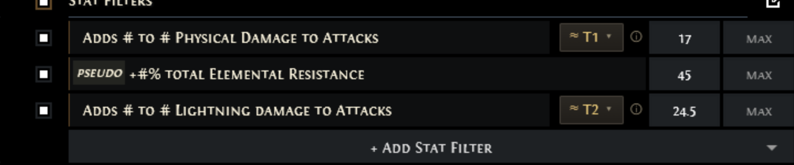
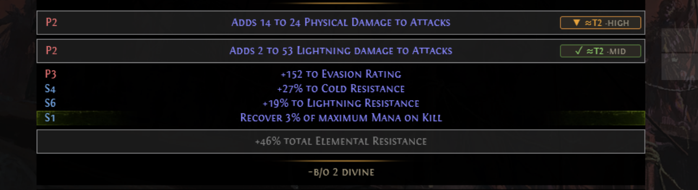

  

<h1 align="center">TierFill — PoE2 Trade Tier Filter</h1>

  Filter <a href="https://www.pathofexile.com/trade2">Path of Exile 2 trade</a> stat mods by
  <b>tier</b> instead of raw numbers.

---

On the PoE2 trade site, every stat filter is a raw `min`/`max` number box. To search for
"tier 2 or better" of a mod, you first have to know the numeric breakpoint and type it in —
and for flat damage mods (`Adds X to Y`) you have to do the averaging math yourself.

**TierFill adds a small tier picker to each stat-filter row.** Pick a mod the normal way,
choose a tier (e.g. `T1`), and it fills the correct `min` value for you.

## Screenshots

Pick a tier and TierFill fills the trade MIN for you (the pseudo row has no control —
data is explicit-only):

Every searched mod on each result is badged with its tier and roll quality — green when it
meets your target tier, amber when it's below:

## Features

- **Per-row tier picker** — a compact `≈ TIER ▾` control appears left of the MIN box on stat
  rows it has data for. Pick a tier; it fills the computed minimum.
- **Handles averaged flat-damage mods** — `Adds # to #` mods are filtered against the *average*
  of the two rolls; TierFill computes the right value automatically.
- **Inclusive / Strict modes** — *Inclusive* never misses a tier (but can leak lucky lower-tier
  rolls); *Strict* only keeps results that are genuinely at the tier or better.
- **Result tier badges** — each searched mod on a result listing is annotated with its tier and
  roll quality, read straight from the trade site's own data, so you can see at a glance which
  results actually hit your target tier.
- **Stays out of the way** — only fills the native inputs and lets the site run the search; works
  alongside other trade extensions. It never automates searches or touches GGG's servers.

## Scope & limitations

TierFill works on **explicit** stat mods — the regular prefixes and suffixes that roll on
weapons, armour, and jewellery. Rows it has tier data for get a picker; everything else is
left untouched, including:

- **Pseudo** mods (e.g. `+#% total Elemental Resistance`),
- **implicit, rune, crafted, and enchant** mods,
- mods on items outside that scope, such as **tablets** and other miscellaneous item types.

When a row has no tier data, TierFill stays silent (no control) rather than guessing — so
those rows just behave as the trade site's normal number boxes.

## Install

- **Firefox:** _[Add-ons listing — coming soon]_
- **Chrome / Edge / Brave:** _[Chrome Web Store listing — coming soon]_

Manual install (for development)

**Firefox:** `about:debugging` → This Firefox → Load Temporary Add-on → pick `manifest.json`.

**Chrome:** `chrome://extensions` → enable Developer mode → Load unpacked → pick this folder.

## How it works

TierFill runs entirely as a content script on the trade page. It detects stat-filter rows,
matches each against a bundled data snapshot of mod tiers, and fills the native MIN input with the
value for the tier you pick (dispatching the events the site needs to register the change). It
does not send searches, call any API, or load GGG's servers — you click the site's own Search
button as usual.

## Privacy

TierFill collects nothing and sends nothing anywhere. All logic and data are local to your
browser. See [PRIVACY.md](PRIVACY.md).

## Data & credits

Tier data is derived from community sources — the mod ladders trace back to
[PoE2DB](https://poe2db.tw/), by way of the
[poe-trade-official-site-enhancer](https://github.com/ghostscript3r/poe-trade-official-site-enhancer)
project's pre-tiered dataset, joined with Path of Exile 2's own trade stat list and corrected
against the trade site's authoritative tier ranges. Thanks to those projects and maintainers.

**Rebuilding the data.** The large build inputs are not committed (they're re-obtainable). The
scripts in `tools/` regenerate the bundled snapshot: running `node tools/refresh.mjs` pulls the
latest community dataset and rebuilds `assets/data-snapshot.json`.

## Disclaimer

This is an unofficial, fan-made tool. It is not affiliated with, endorsed by, or associated with
**Grinding Gear Games**. Path of Exile and Path of Exile 2 are trademarks of Grinding Gear Games.

## License

[MIT](LICENSE) © 2026 Sknoww
